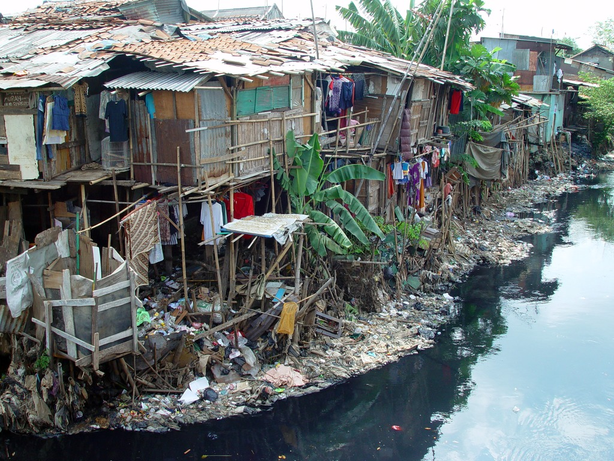
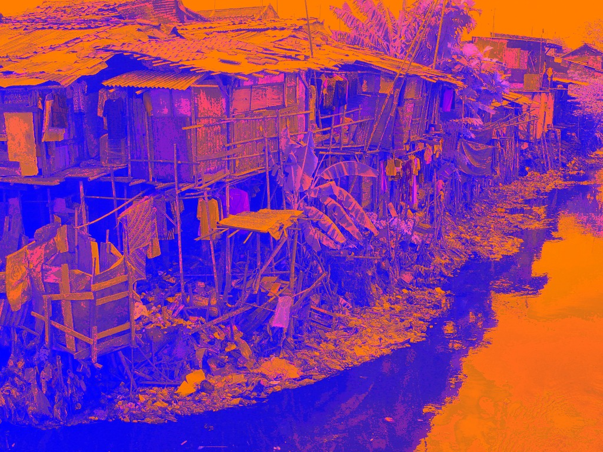
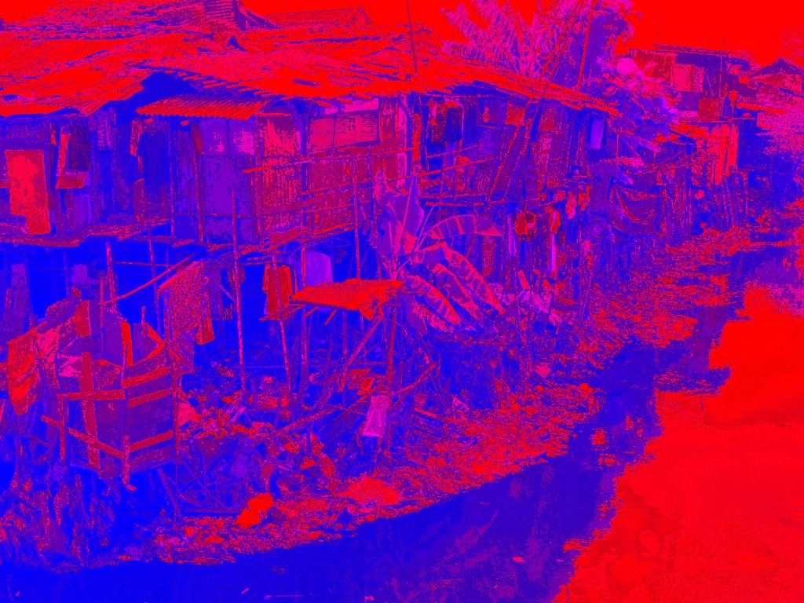

Transformati svaki pixel date slike na sledeći način:

crveni kanal:
    primeniti ``OR`` bitwise operator nad ovim i zelenim kanalom
zeleni kanal:
    pomeriti udesno bite koji pripadaju ovom kanalu za ukupno ``offset`` podeoka

    ``offset`` je ceo broj koji se unosi kao argument komandne linije
plavi kanal:
    obrnuti bite koji pripadaju ovom kanalu

Primer poziva programa::

    ./feature-detection original.bmp processed-low.bmp 1

sa ``offset=1``, zadatim ulazom u datoteci ``original.bmp``:

i očekivanim izlazom u datoteci ``processed-low.bmp``:

Primer poziva programa::

    ./feature-detection original.bmp processed-high.bmp 7

sa ``offset=7``, zadatim ulazom u datoteci ``original.bmp``:

i očekivanim izlazom u datoteci ``processed-high.bmp``:

Izvor slike:
https://en.wikipedia.org/wiki/File:Jakarta_slumhome_2.jpg (CC BY 2.0)

Ograničenja zadatka:

- zadatak rešiti upotrebom **jednostruko spregnute liste**
- sva dinamički zauzeta memorija mora biti oslobođena na odgovarajući način
